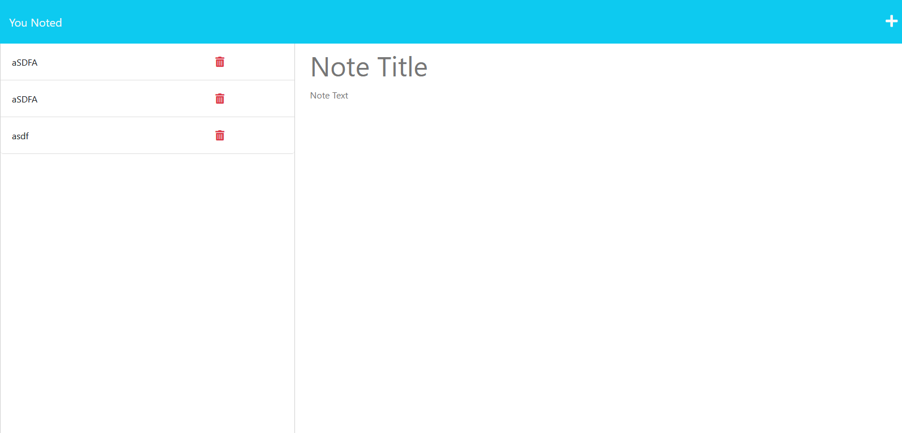

# Note-Taker

## Table of Contents
 - [Description](#description)
 - [Installation](#installation)
 - [Usage](#usage)
 - [Credits](#credits)
 - [Features](#features)
 - [Contact](#contact)
 - [License](#license)

## Description
I wanted to showcase my understanding of ExpressJS middleware and create an application where the user can take notes. It has the ability to post, view and delete created notes and stores them by UUID, so you can put as many duplicates as you want. This project will use Heroku to be run on official servers

## Installation
Run "npm install" to install dependencies, then run "node server.js", wherein the server will start on 127.0.0.1:5001

## Usage
Visit 127.0.0.1:5001 if you are running on a local server, otherwise the application is deployed at heroku ->[here](https://you-noted-a64d6c755938.herokuapp.com/)  
 Click start to begin, add a note if youd like by typing in the note input fields and pressing the save button. Click on any note to navigate to it for viewing, and the red trashcan icon to delete it.
    

## Credits
TA's, instructor, and many documentation websites.

## Features
Saving notes, deleting notes, viewing notes, saving by unique uuid, modular routing.. etc

- GitHub Profile: [IkonicRes](https://github.com/IkonicRes)

- For additional questions, reach out to Ikonicresonance@gmail.com.

## Contact

Preferred method of communication: Github

## License

MIT License

    Permission is hereby granted, free of charge, to any person obtaining a copy of this software and associated documentation files (the "Software"), to deal in the Software without restriction, including without limitation the rights to use, copy, modify, merge, publish, distribute, sublicense, and/or sell copies of the Software, and to permit persons to whom the Software is furnished to do so, subject to the following conditions: The above copyright notice and this permission notice shall be included in all copies or substantial portions of the Software. THE SOFTWARE IS PROVIDED "AS IS", WITHOUT WARRANTY OF ANY KIND, EXPRESS OR IMPLIED, INCLUDING BUT NOT LIMITED TO THE WARRANTIES OF MERCHANTABILITY, FITNESS FOR A PARTICULAR PURPOSE AND NONINFRINGEMENT. IN NO EVENT SHALL THE AUTHORS OR COPYRIGHT HOLDERS BE LIABLE FOR ANY CLAIM, DAMAGES OR OTHER LIABILITY, WHETHER IN AN ACTION OF CONTRACT, TORT OR OTHERWISE, ARISING FROM, OUT OF OR IN CONNECTION WITH THE SOFTWARE OR THE USE OR OTHER DEALINGS IN THE SOFTWARE.

